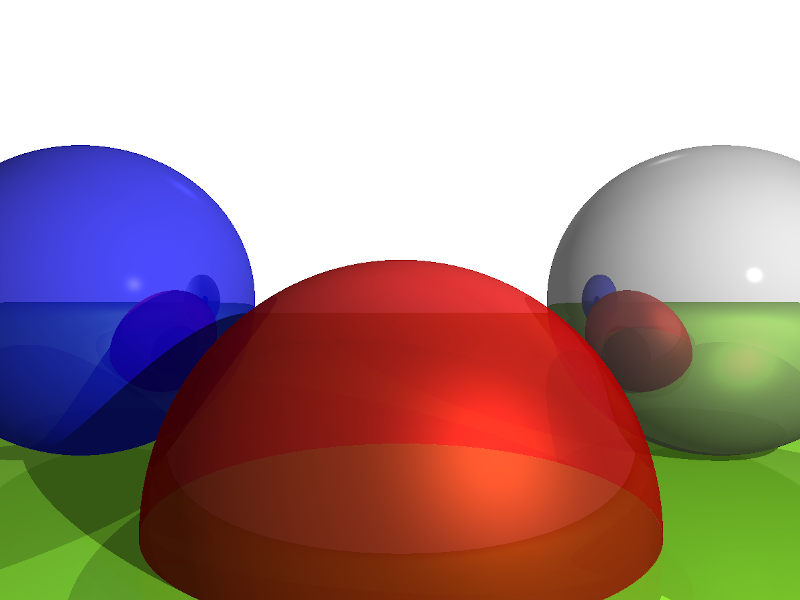

# raytracer-cpp
Basic C++ software raytracer, created as a learning exercise. Based on the
introduction to raytracing provided in the book "Computer Graphics From Scratch"
by Gabriel Gambetta, with some modifications and extensions of my own.



## Requirements / Dependencies
* g++ 10 or later
* cmake 3.17 or later
* sfml 2.5.0 or later
    * Package must be visible to cmake. Installing via your distro's package
      manager is probably most convenient.

This project includes [Vec](https://github.com/embeddr/vec) as a submodule. Vec
provides basic vector/matrix classes and operations for games and other 3D
applications. Be sure to initialize submodules after cloning to fetch required
submodule data:
```
git submodule update --init --recursive
```

## Build and Run
This application is built using cmake. As an example, the following will build
a release binary with optimizations:

```
cd <project-root>
cmake -Bcmake-build-release -H. -DCMAKE_BUILD_TYPE=release
cmake --build cmake-build-release --target all
```

If the build was successful, an output binary titled `raytracer` will be located
under `cmake-build-release` in the project directory. To run:

```
./cmake-build-release/raytracer
```

Alternatively, import this project into an IDE with cmake integration (such as
CLion) for convenience.

### Camera Control

The rendered scene includes multiple camera perspectives. Press spacebar to move to the next
camera position/orientation.